

# Keenetic Router Integration for Home Assistant
[Russian ver.](README_RU.md)

This is a Home Assistant custom integration for Keenetic Routers. It provides detailed information about your Keenetic router including WiFi networks, ethernet ports, and mesh network status.

## Features

- Monitor router system information (CPU, memory, uptime)
- Control WiFi networks (enable/disable)
- Control Mobile networks (enable/disable)
- View ethernet port status and statistics
- Monitor mesh network nodes
- View detailed interface statistics

## Installation

### HACS (Recommended)

1. Open HACS
2. Click on "Integrations"
3. Click the "+" button
4. Search for "Keenetic Router"
5. Click "Install"
6. Restart Home Assistant

### Manual Installation

1. Download the latest release
2. Copy the `ha_keenetic` folder to your `custom_components` directory
3. Restart Home Assistant

### Important Points

The integration communicates with the router via REST API, for which you need to configure port forwarding:

1. Access your router's web interface
2. Go to "Port Forwarding" > "Add rule"
3. Configure the following parameters:
   - Enable rule: ✓ (enabled)
   - Description: rest api
   - Input: Other destination
   - IP address: 192.168.1.0 (local network address where HomeAssistant is located)
   - Subnet mask: 255.255.255.0 (/24)
   - Output: This Keenetic device
   - Protocol: TCP
   - Rule type: Single port
   - Open the port: 81
   - Redirect to port: 79
   - Work schedule: Always on

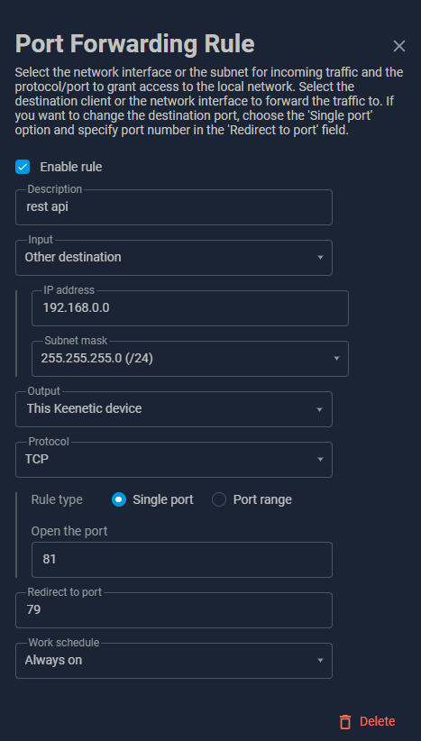

⚠️ Security Recommendation:
For enhanced security, it is recommended to configure Firewall rules to allow REST API access only from your Home Assistant IP address. This helps protect the router from unauthorized access within the local network.

To enable automatic router discovery, you need to enable UPnP on your Keenetic:

1. Access your router's web interface
2. Go to "System Settings" > "Component options"
3. Make sure "UPnP" is enabled:

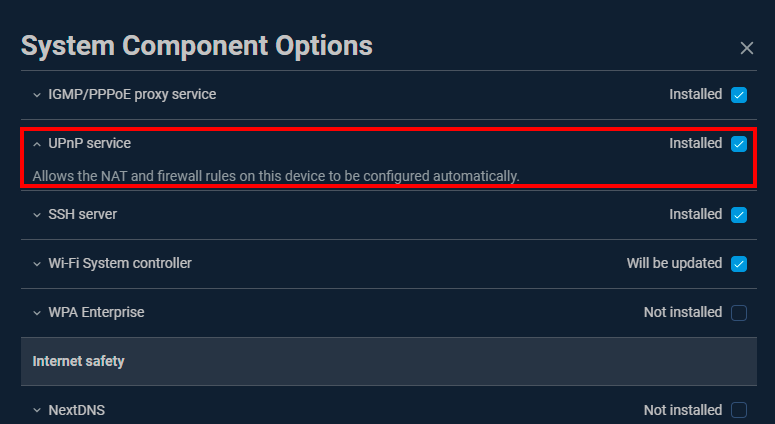

## Automatic Setup

If UPnP is enabled, the integration will discover the router.

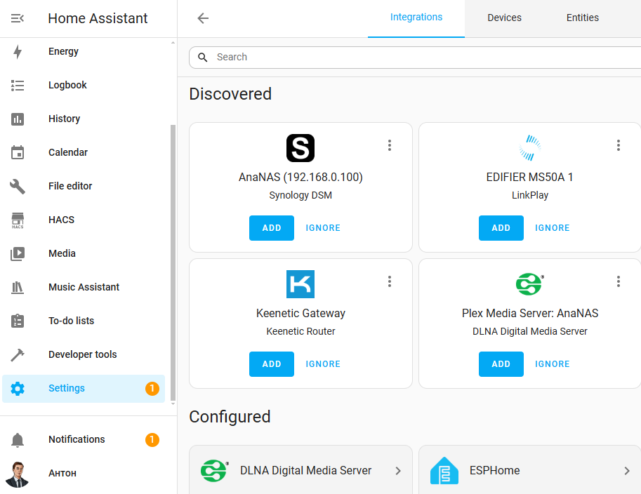

## Manual Setup

1. Go to "Settings" > "Devices & services"
2. Click the "+ ADD INTEGRATION" button
3. Search for "Keenetic Router"
4. Enter your router details:
   - IP address (default: 192.168.1.1)
   - Port (default: 81)
   - Username (default: admin)
   - Password

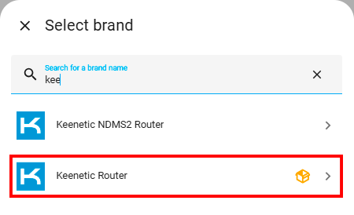

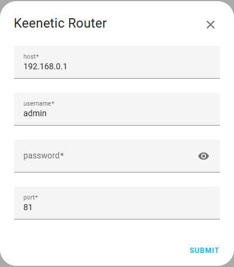

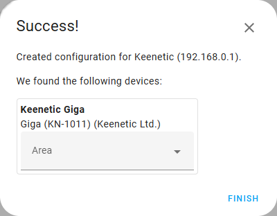

## Supported Devices

The integration has been tested with the following models:
- Keenetic Giga
- Keenetic Hero 4g
- Keenetic Sprinter SE

Other Keenetic models should also work.

## Available Entities

### Sensors
- System information (CPU, memory, uptime)
- WiFi networks status
- Ethernet ports status
- Mesh network nodes status

### Switches
- WiFi networks (enable/disable)

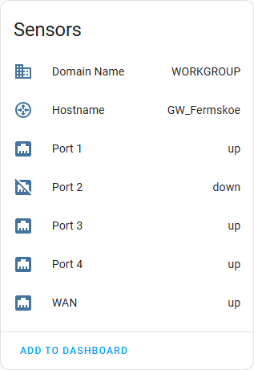

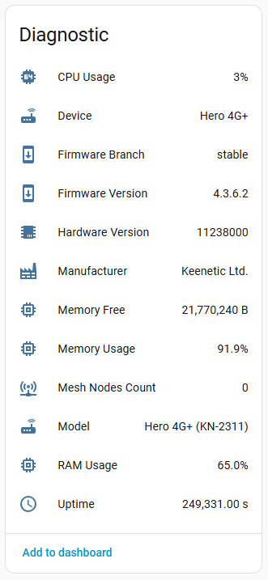

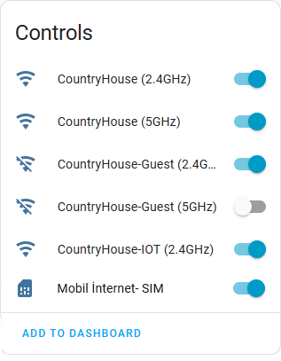

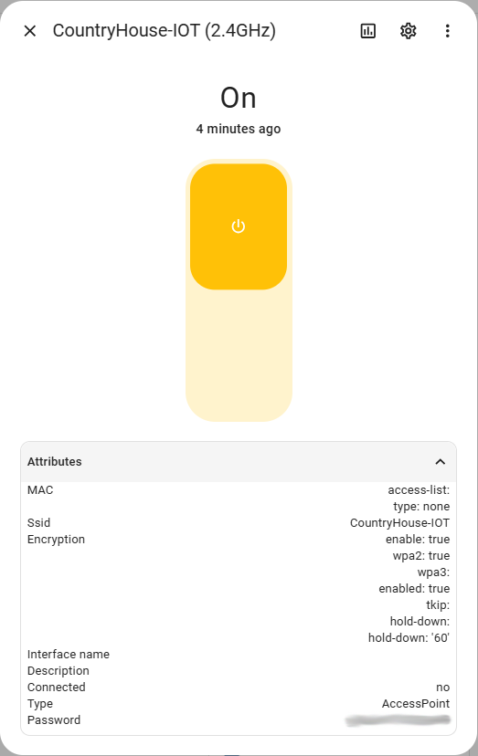

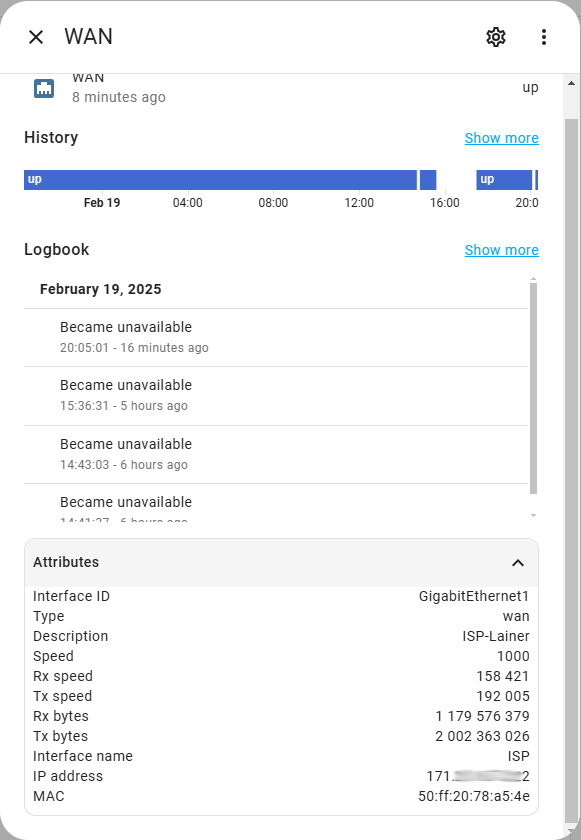

Mesh devices information (if available):

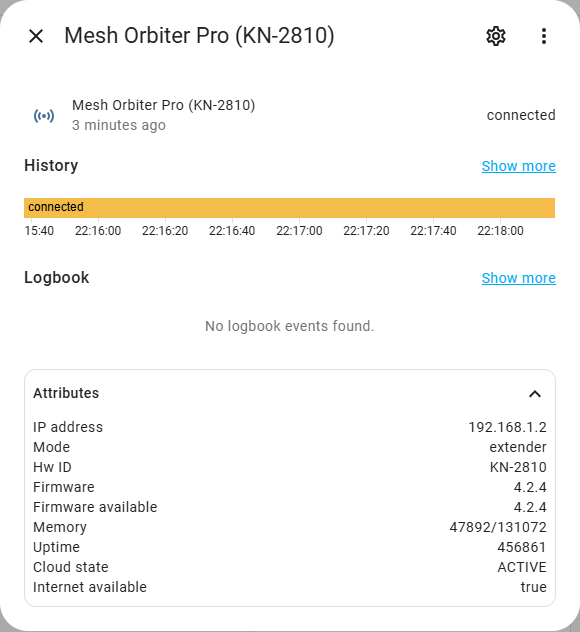

Mobile devices information (if available):
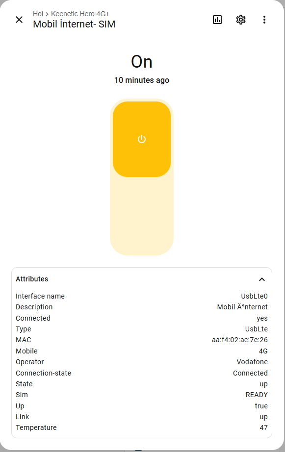

## Contributing

Any suggestions for improvement are welcome.

## License

This project is licensed under the MIT License - see the [LICENSE](LICENSE) file for details.
