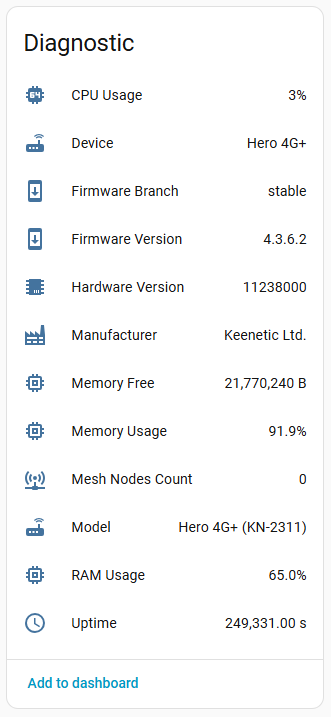
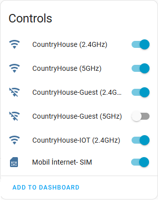

# Интеграция Keenetic Router для Home Assistant
[English ver.](README.md)

Это пользовательская интеграция для маршрутизаторов Keenetic в Home Assistant. Она предоставляет подробную информацию о вашем роутере Keenetic, включая состояние WiFi сетей, ethernet портов и mesh-сети.

## Возможности

- Мониторинг системной информации роутера (CPU, память, время работы)
- Управление WiFi сетями (включение/выключение)
- Просмотр состояния и статистики ethernet портов
- Мониторинг узлов mesh-сети
- Просмотр детальной статистики интерфейсов

## Установка

### Через HACS (Рекомендуется)

1. Откройте HACS
2. Нажмите "Integrations"
3. Нажмите кнопку "+"
4. Найдите "Keenetic Router"
5. Нажмите "Install"
6. Перезагрузите Home Assistant

### Ручная установка

1. Скачайте последний релиз
2. Скопируйте папку `ha_keenetic` в директорию `custom_components`
3. Перезагрузите Home Assistant

### Важные моменты

Интеграция обменивается с роутером данными через REST API, для его работы необходимо настроить переадресацию портов:

1. Зайдите в веб-интерфейс роутера
2. Перейдите в раздел "Port Forwarding" > "Add rule"
3. Настройте следующие параметры:
   - Enable rule: ✓ (включено)
   - Description: rest api
   - Input: Other destination
   - IP address: 192.168.1.0 (адрес локальной сети в которой находится HomeAssistant)
   - Subnet mask: 255.255.255.0 (/24)
   - Output: This Keenetic device
   - Protocol: TCP
   - Rule type: Single port
   - Open the port: 81
   - Redirect to port: 79
   - Work schedule: Always on

⚠️ Рекомендация по безопасности:
Для повышения безопасности рекомендуется настроить правила Firewall таким образом, чтобы доступ к REST API был разрешен только с IP-адреса вашего Home Assistant. Это поможет защитить роутер от несанкционированного доступа из локальной сети.

Для автоматического обнаружения роутера в сети необходимо включить UPnP на вашем Keenetic:

1. Зайдите в веб-интерфейс роутера
2. Перейдите в раздел "System Settings" > "Component options"
3. Убедитесь, что "UPnP" включен:

## Автоматическая настройка

Если UPnP включен, то интеграция обнаружит роутер.

## Ручная настройка

1. Перейдите в "Settings" > "Devices & services"
2. Нажмите кнопку "+ ADD INTEGRATION"
3. Найдите "Keenetic Router"
4. Введите данные вашего роутера:
   - IP адрес (по умолчанию: 192.168.1.1)
   - Порт (по умолчанию: 81)
   - Имя пользователя (по умолчанию: admin)
   - Пароль

## Поддерживаемые устройства

Интеграция протестирована со следующими моделями:
- Keenetic Giga
- Keenetic Hero 4g
- Keenetic Sprinter SE

Другие модели Keenetic также должны работать.

## Доступные сущности

### Сенсоры
- Системная информация (CPU, память, время работы)
- Состояние WiFi сетей
- Состояние Ethernet портов
- Состояние узлов Mesh-сети

### Переключатели
- WiFi сети (включение/выключение)

Информация о Mesh устройствах (если имеются):

## Участие в разработке

Приветствуются любые предложения по улучшению проекта.

## Лицензия

Этот проект распространяется под лицензией MIT - подробности смотрите в файле [LICENSE](LICENSE).
